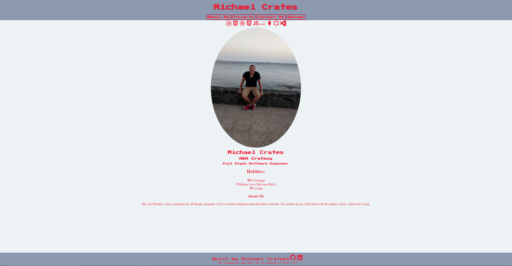
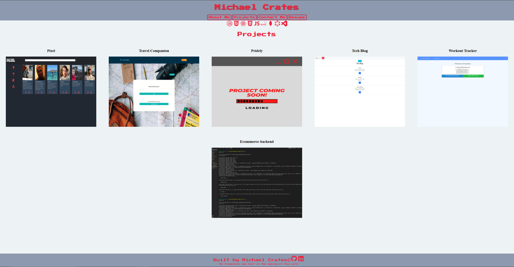
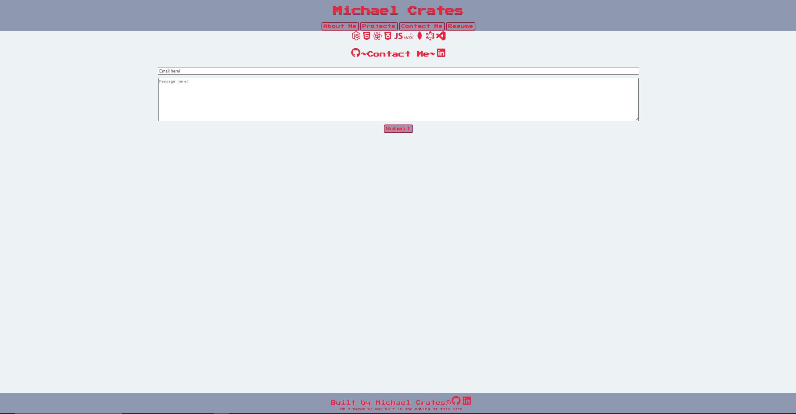

# React Portfolio


## Table of Contents

- [React Portfolio](#react-portfolio)
  - [Table of Contents](#table-of-contents)
  - [deployed url](#deployed-url)
  - [Description](#description)
  - [Installation](#installation)
  - [Usage](#usage)
  - [License](#license)
  - [Contributing](#contributing)
  - [Tests](#tests)
  - [screenshots](#screenshots)

## deployed url

https://cratesy.github.io/react-portfolio/#/

## Description

I've been tasked with making a portfolio using react. I've made multiple pages and rendered them using assortment of components.
I found having components made life easier when building up each page. It also makes the component reusable by passing it props.
I used formspree react to submit the contact form, this emails me the form instantly.
I also decided not to use any frameworks ie ("bootstrap") as i like to decide myself how it looks and which position it goes too, This however is very time consuming.

## Installation

```
git clone git@github.com:Cratesy/react-portfolio.git
cd react-portfolio
npm install
```

## Usage

As a user, you can visit my portfolio see my about me page,
you can also navigate to my projects page and see all my projects ive been working on.
As a user you can navigate to the contact me page and fill in a contact me form inputting email & message which will be sent to me.
you can also click on resume to view/download my resume and click github or linkedin logos to take you to my relative page.

## License

[MIT License](https://opensource.org/licenses/MIT)

## Contributing

[Mike](https://github.com/Cratesy)

## Tests

None were need

## screenshots






